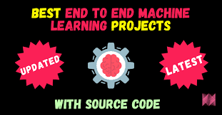

# AI-Powered Resume Classifier - Automated Resume Categorization

An automated system that extracts, cleans, and categorizes resumes using NLP and Machine Learning. It processes PDFs, predicts job categories, organizes resumes into folders, and logs results in a CSV file—streamlining resume screening for recruiters!

## 📌 Project Overview
This project automates the process of categorizing resumes using Natural Language Processing (NLP) and Machine Learning (ML). It extracts text from resume PDFs, cleans and preprocesses the text, and classifies resumes into predefined job categories using a trained ML model. Once categorized, resumes are automatically moved into respective folders, and a CSV report is generated for easy tracking. The project leverages PyPDF2 for text extraction, NLTK for preprocessing, and Scikit-learn for classification. It streamlines the hiring process by organizing resumes efficiently, making it an essential tool for recruiters and HR professionals. 


## 🎥 Demo Video
Watch the demo video of how the project works:

[](https://youtu.be/nDdps-DpMRo)


## 📂 Directory Structure

```
📦 Resume Classifier
├── 📂 Raw Resumes                # Folder containing raw resume PDFs
├── 📂 Resume                     # Processed resumes directory
├── 📜 README.md                   # Project documentation
├── 📜 best_clf.pkl                # Trained classifier model
├── 📜 requirements.txt            # Dependencies and requirements
├── 📜 resume_categorization.ipynb # Jupyter Notebook for analysis
├── 📜 script.py                   # Main script for resume classification
├── 📜 tfidf.pkl                    # TF-IDF vectorizer model
```

## 🚀 Installation & Setup
1. Clone the repository:
   ```sh
   git clone https://github.com/your-repo/resume-classifier.git
   ```
2. Navigate to the project directory:
   ```sh
   cd resume-classifier
   ```
3. Install the required dependencies:
   ```sh
   pip install -r requirements.txt
   ```
4. **Add Resumes for Categorization**
   - Place all your resumes in the `Raw Resumes` folder inside the project directory.
   - Ensure resumes are in PDF format for proper text extraction.
   - The classifier will categorize the resumes based on job descriptions.

## 📝 Description
This project employs various machine learning models and a deep learning approach to identify job categories from resumes. Using datasets, resumes are processed and classified using models such as:

- Random Forest Classifier
- Logistic Regression
- K-Nearest Neighbor
- Support Vector Machine (SVM)
- Deep Learning: Artificial Neural Networks (ANN) and Long Short-Term Memory (LSTM)

The model training is performed on preprocessed data, and the results are used to create a functional script that categorizes resumes automatically.

## 🔄 Workflow
### Data Preprocessing:
- Split the dataset into `resume_data` (training set) and `resume_test_data` (testing set).
- Clean the text data by removing unnecessary symbols, spaces, and irrelevant content.

### Feature Extraction:
- Use NLP techniques such as TF-IDF vectorization to extract meaningful features from the resumes.

### Model Training:
- Train multiple models to identify the best-performing one for classifying resumes into categories.
- Save the trained classifier (`best_clf.pkl`) and the vectorizer (`tfidf.pkl`) as pickle files.

### Automated Categorization:
- Use `script.py` to load the test data (PDF resumes in `test_data/`), vectorize the content, and predict categories.
- Organize resumes into corresponding folders based on their predicted category.

## 📂 Dataset
- **Source**: [GitHub - Sbhawal/resumeScraper](https://github.com/Sbhawal/resumeScraper)
- **Description**: The dataset contains resumes from different professional fields, including Advocate, Information Technology, and more.
- **Key Features**:
  - `ResumeID`: Unique identifier for each resume
  - `Category`: Field of profession (e.g., Advocate, IT, HR, etc.)
  - `ResumeText`: Raw textual data of resumes
  - `Skills`: Extracted skills from resumes
  - `Experience`: Years of experience mentioned in resumes

## 🛠️ Tech Stack
Your AI-Powered Resume Classifier project utilizes a combination of data science, machine learning, and software development technologies:

- **Programming Language**: Python – Core language for data processing, model training, and automation.
- **Libraries & Frameworks**:
  - **Machine Learning & NLP**:
    - `scikit-learn` – Used for training the classification model.
    - `nltk` – Natural Language Processing for tokenization, stopword removal, and text preprocessing.
    - `pandas` – Data manipulation and processing.
    - `numpy` – Numerical operations and array handling.
  - **PDF Processing & File Handling**:
    - `PyPDF2` – Extracting text from PDF resumes.
    - `os` & `shutil` – File system operations to categorize and move resumes.
  - **Version Control & Deployment**:
    - `Git & GitHub` – Managing the project repository and collaboration.

## 📞 Contact
- **GitHub**: [My GitHub Profile](https://github.com/Codewtithdips)
- **LinkedIn**: [My LinkedIn Profile](https://www.linkedin.com/in/dipankardebnath-/)
- **Email**: debnathdpankar27@gmail.com

